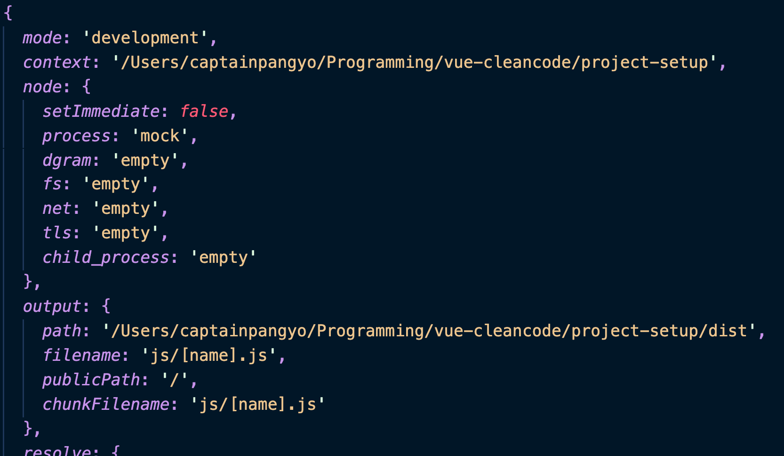

# Vue CLI로 생성한 프로젝트의 웹팩 설정 방법

Vue CLI로 생성한 프로젝트에 웹팩 설정을 변경하려면 어떻게 해야 할까요? 웹팩 설정 확인 & 변경 방법에 대해 알아봅니다.

## Vue CLI로 생성한 프로젝트와 웹팩의 관계?

보통 Vue.js를 배우고 나면 실제 서비스를 만들 때 뷰 CLI를 이용해서 프로젝트를 생성할텐데요.

```bash
vue create my-project
```

이렇게 생성된 뷰 프로젝트는 웹팩을 기반으로 동작합니다.

- `npm run serve` : 로컬 서버를 웹팩 데브 서버로 실행
- `npm run build` : 웹팩으로 최종 결과물 변환(빌드)

::: tip
웹팩은 최신 프런트엔드 빌드 시스템의 핵심이 되는 빌드 도구입니다. 웹팩을 잘 모르시는 분들은 [웹팩 강의](https://www.inflearn.com/course/프런트엔드-웹팩?inst=747606f7&utm_source=blog&utm_medium=githubio&utm_campaign=captianpangyo&utm_term=banner)나 [웹팩 핸드북](https://joshua1988.github.io/webpack-guide/)을 참고해서 학습해 보세요 😄
:::

## 생성된 뷰 프로젝트에 웹팩 설정 파일이 안보이는데요?

뷰 CLI 버전 2 이하에서는 웹팩 설정 파일(webpack.config.js)이 프로젝트 루트 레벨에 노출되어 있었습니다. 이런 부분이 웹팩에 익숙하지 않은 사용자들에게는 부담이 되었는데요. 그래서 뷰 CLI 버전 3 이상부터는 웹팩 설정 파일을 아래와 같이 `vue-cli-service`라는 이름으로 감추어 놓았습니다.


위 폴더 위치는 아래와 같습니다.

```
src
node_modules
  @vue
    cli-service
...
```

결과적으로 사용자들에게는 서버 시작 명령어와 빌드 명령어만 알려주면 웹팩은 몰라도 되게끔 기본적인 설정을 해놓은 것입니다.

```json
// package.json
{
  "scripts": {
    "serve": "vue-cli-service serve",
    "build": "vue-cli-service build"
  }
}
```

## 그럼 프로젝트에 설정되어 있는 웹팩 옵션 속성을 어떻게 볼 수 있나요?

만약 웹팩 설정 파일 `webpack.config.js`가 프로젝트 루트 레벨로 나와 있다면 바로 보면 되겠지만 `vue-cli-service` 내부에 여러 파일들로 나뉘어져 있어 한눈에 파악하기 어렵습니다. 이 때 프로젝트에 설정된 웹팩 옵션들을 보고 싶다면 아래 명령어를 입력합니다.

```sh
vue inspect > options.js
```

위 명령어를 치면 프로젝트 내부적으로 설정된 웹팩의 옵션들을 `options.js` 파일에 담아줍니다. 이제 `options.js` 파일을 열어보면 아래 내용을 확인할 수 있습니다.



## 프로젝트의 웹팩 설정을 수정하고 싶다면?

프로젝트에 설정되어 있는 웹팩의 옵션들을 변경하고 싶다면 `vue.config.js` 파일을 변경해야 합니다.

```js
// vue.config.js
module.exports = {
  outputDir: 'my-dist',
}
```

위 `outputDir` 속성은 웹팩 설정 파일의 [output.path](https://webpack.js.org/configuration/output/#outputpath)와 동일한 옵션입니다. 이렇게 [뷰 CLI의 공식 가이드에 안내된 내용](https://cli.vuejs.org/config/#vue-config-js)을 따라 웹팩 설정을 변경해 주셔야 최종 빌드에서 사용자가 변경한 값이 함께 적용됩니다.

이외에도 아래와 같은 옵션들을 이용하여 웹팩 설정을 추가 또는 체이닝을 할 수 있습니다.

```js
// vue.config.js
module.exports = {
  // 옵션 추가
  configureWebpack: {
    plugins: [
      new MyAwesomeWebpackPlugin()
    ]
  },
  // 옵션 체이닝
  configureWebpack: config => {
    if (process.env.NODE_ENV === 'production') {
      // mutate config for production...
    } else {
      // mutate for development...
    }
  }
}
```

[옵션 추가와 체이닝 방법의 정확한 가이드](https://cli.vuejs.org/guide/webpack.html)는 CLI 공식 문서를 참고하세요 :)